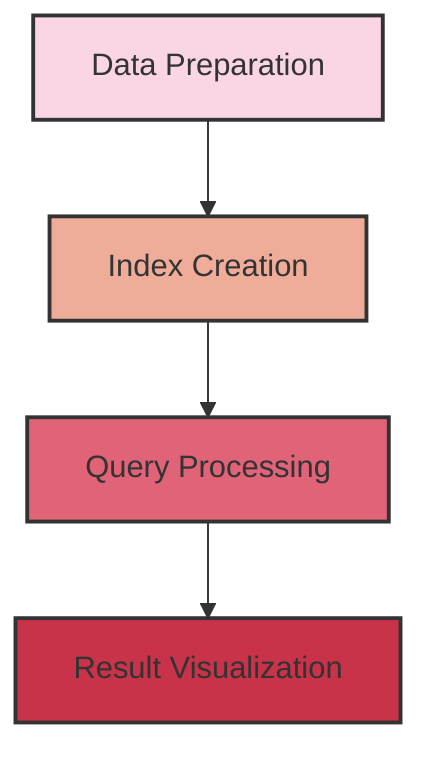

# Multi-Modal RAG 

## 📑 Todo List
- 👉 Multi Model RAG Pipeline
   - [x] 小型pipeline完成
   - [x] 大一点的开源数据库--coco
   - [x] 整理project的结构
   - [x] 尝试多线程并发，观察资源占用
   - [x] 不同；类型的搜索返回的相似度不同 
   

- ⭐ Agentic RAG 
   - [ ] pipeline


- 复杂度不够 烦🤦‍♀️
   - [x] 大一点的开源数据库
   - [ ] ❗已有模型的压力测试
   - [ ] graph rag pipeline
   - [ ] agentic rag pipeline


- 🐱‍🏍 臭老哥的To-do-list 
   - [ ]  MCP
   - [ ]  LLM generation 
   - [ ] >>> 长期线 代码重构

## 🚀 Quick Start


   ```

2. Install dependencies:
   ```bash
   pip install -r requirements.txt
   ```


## 📚 How It Works

1. **Data Preparation**: The system scans the specified directory for image-text pairs.

2. **Index Creation**: A multi-modal index is created using LlamaIndex, storing both text and image embeddings.

3. **Query Processing**: Users can input queries, and the system retrieves relevant text and images.

4. **Visualization**: Retrieved images are displayed using matplotlib.

Here's a simple visualization of the pipeline:




## 🛠️ Configuration

You can customize the pipeline by modifying the following parameters in `config.py`:

- `DATA_PATH`: Path to your image and text data
- `QDRANT_PATH`: Path for local Qdrant storage
- `TOP_K`: Number of results to retrieve for each query


## 🙏 Acknowledgements

- [LlamaIndex](https://github.com/jerryjliu/llama_index) for the indexing framework
- [Qdrant](https://github.com/qdrant/qdrant) for the vector database
- [CLIP](https://github.com/openai/CLIP) for image embeddings

📊 📄 🤝

Nsight System Profiler CIL :
   ```bash
   nsys profile  -o my_report \
    -t cuda,nvtx \
    --gpu-metrics-device 1 \
    --force-overwrite true \
    python stress_test.py

   ```
 HF_ENDPOINT=https://hf-mirror.com hfd intfloat/e5-mistral-7b-instruct
 HF_ENDPOINT=https://hf-mirror.com hfd HuggingFaceM4/idefics2-8b 

https://hf-mirror.com/HuggingFaceM4/idefics2-8b