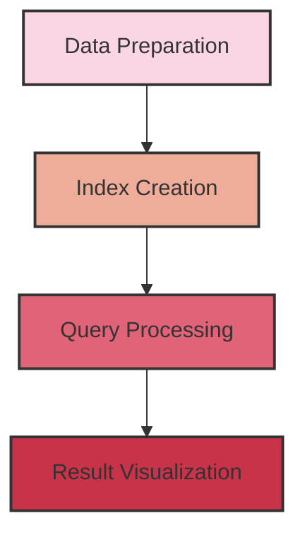

# Multi-Modal RAG 

## 📑 Todo List
- Multi Model RAG Pipeline
   - [x] 小型pipeline完成
   - [x] 大一点的开源数据库--coco
   - [x] 整理project的结构
   - [ ] 尝试多线程并发，观察资源占用


- Agentic RAG
   - [ ] pipeline
   

## 🌟 Features

- Local processing of images and text
- Integration with Qdrant vector store
- CLIP image embedding for efficient image retrieval
- Multi-modal index creation using LlamaIndex
- Interactive query system with both text and image results


## 🚀 Quick Start

1. Clone the repository:
   ```bash
   git clone https://github.com/naimkatiman/Multi-Modal-RAG-Pipeline-on-Images-and-Text-Locally.git
   cd Multi-Modal-RAG-Pipeline-on-Images-and-Text-Locally
   ```

2. Install dependencies:
   ```bash
   pip install -r requirements.txt
   ```

3. Prepare your data:
   - Place your image files (.jpg or .png) in the `data` directory
   - Ensure corresponding text files (.txt) with the same name exist for each image

4. Run the pipeline:
   ```python
   python myRAG.ipynb
   ```

## 📚 How It Works

1. **Data Preparation**: The system scans the specified directory for image-text pairs.

2. **Index Creation**: A multi-modal index is created using LlamaIndex, storing both text and image embeddings.

3. **Query Processing**: Users can input queries, and the system retrieves relevant text and images.

4. **Visualization**: Retrieved images are displayed using matplotlib.

Here's a simple visualization of the pipeline:




## 🛠️ Configuration

You can customize the pipeline by modifying the following parameters in `config.py`:

- `DATA_PATH`: Path to your image and text data
- `QDRANT_PATH`: Path for local Qdrant storage
- `TOP_K`: Number of results to retrieve for each query


## 🙏 Acknowledgements

- [LlamaIndex](https://github.com/jerryjliu/llama_index) for the indexing framework
- [Qdrant](https://github.com/qdrant/qdrant) for the vector database
- [CLIP](https://github.com/openai/CLIP) for image embeddings

📊 📄 🤝


